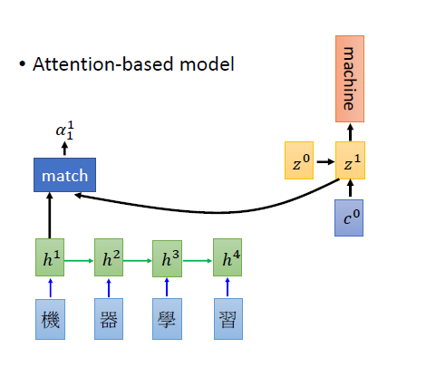

[TOC]


## **1. RNN（循环神经网络）**

**神经网络**可以当做是能够拟合任意函数的黑盒子，只要训练数据足够，给定特定的x，就能得到希望的y，结构图如下：


将神经网络模型训练好之后，在输入层给定一个x，通过网络之后就能够在输出层得到特定的y。

### **1.1 RNN结构：**


### **1.2 为什么需要RNN（循环神经网络）**

神经网络都只能单独的去处理一个个的输入，前一个输入和后一个输入是完全没有关系的。但是，某些任务需要能够更好的处理序列的信息，即前面的输入和后面的输入是需要联系的。

当我们在理解一句话意思时，孤立的理解这句话的每个词是不够的，我们需要联系上下文去处理这些词连接起来的整个序列。RNN的记忆功能可以把这些词联系起来。

**举个例子**：

Slot Filling：槽位填充，也是序列标注的一种。


## **2. seq2seq结构**

seq2seq属于Encoder-Decoder结构的一种，基本思想就是利用两个RNN，一个RNN作为Encoder，另一个RNN作为Decoder。

### **2.1 Encoder：**

Encoder负责将输入序列压缩成指定的长度的向量，这个向量可以看成是这个序列的语义，这个过程称作编码。获取语义向量最简单的方式就是直接将最后一个输入的隐状态作为语义向量C, 如下图所示：


### **2.2 Decoder：**

Decoder负责根据语义向量生成指定的序列，这个过程称作解码，最简单的方式是将encoder得到的语义变量作为初始状态输入到decoder的RNN中，得到输出序列。可以看到上一时刻的输出会作为当前时刻的输入，而且其中语义向量C只作为初始状态参与运算，后面的运算都与语义向量C无关。如下图所示:


### **2.3 缺点：**

这种固定长度的上下文序列设计的一个关键和明显的缺点是系统无法记住更长的序列。一旦处理完整个序列，通常会忘记序列的早期部分。注意机制的诞生是为了解决这个问题


## **3. Attention机制在seq2seq模型中的应用**

### **3.1 为什么要用Attention机制**

把一个中间向量C，用于保存原序列的语言信息。但是这个向量长度是固定的，当输入原序列的长度比较长时，向量C无法保存全部的语义信息，上下文语义信息受到了限制，这也限制了模型的理解能力，所以使用Attention机制来打破这种原始编解码模型对固定向量的限制

### **3.2 Attention模型的引入**

Attention机制跟人类翻译文章时候的思路有些类似，即将注意力关注于我们翻译部分对应的上下文。同样的，Attention模型中，我们翻译当前词语时，我们会寻找源语句中相对应的几个词语，并结合之前的已经翻译的部分作出相应的翻译，如下图所示，当我们翻译“knowledge”时，只需将注意力放在源句中“知识”的部分，当翻译power时，只需将注意力集中在“力量”。


### **3.3 Attention的算法过程**

1） Encoder 对输入序列编码得到最后一个时间步的状态c,和每个时间步的输出h,其中c又作为Decoder的初始状态z~0~

2） 对于每个时间步的输出h与z0做匹配也就是match操作，得到每个时间步的匹配向量α10 ,如下图所示：


3）对所有时间步的输出h与z0的匹配度α0，使用softmax做归一化处理，得到各个时间步对于z0的匹配分数

4）求各个时间步的输出h与匹配分数的加权求和得到c0，作为Decoder的下一个时间步的输入，如下图所示：



5）计算各个时间步的输出h与z1的匹配度得到c1作为Decoder下一个时间步的输入，如此一步步重复下去，如下图所示：


## **4. seq2seq with attention模型整个算法过程**

### **4.1 在Encoder阶段：**

+ 为了方便阐述，选取了编码和解码都是RNN的组合（当然也可以选择LSTM、GRU等）。在RNN中，当前时间的隐藏状态是由上一时间状态和当前时间决定的，也就是

$$
h_t = f(h_{t-1},x_t)
$$

+ 获得各个时间端的隐藏层以后，再将各个隐藏层的信息汇总，生成最后的语义向量C=q(h~1~,h~2~,h~3~,...,h~Tx~,)

### **4.2 在Decoder阶段：**

+ 解码阶段可以看做编码的逆过程，这个阶段我们要根据给定的语义向量C和之前已经生成的输出序列y~1~,y~2~,...y~t-1~来预测下一个输出的单词y~t~,即
    $$
    y_t=argmaxP(y_t)= \prod_{t=1}^{T}p(y_t|y_1,...y_{t-1},C)
    $$
    在RNN中，上式可以简化成 
    $$
    y_t=g(y_{t-1},s_t,C)
    $$

+ 解码部分使用了attention模型，我们可以将上式的条件概率写作
    $$
    p(y_i|y_1,...,y_{i-1},X)=g(y_{i-1},s_i,c_i)
    $$
    
+ 上述公式中s~i~表示解码器i时刻的隐藏状态。计算公式是

$$
s_i=f(s_{i-1},y_{i-1},c_i)
$$

+ 内容c~i~是由编码时的隐藏向量序列（h~1~,...,h~Tx~)按权重相加得到的，公式如下：
    $$
    c_i = \sum_{j=1}^{Tx}a_{ij}h_j
    $$

+ 由于编码使用了双向RNN，因此可以认为hihi中包含了输入序列中第i个词以及前后一些词的信息。将隐藏向量序列按权重相加，表示在生成第j个输出的时候的注意力分配是不同的。α~ij~的值越高，表示第i个输出在第j个输入上分配的注意力越多，在生成第i个输出的时候受第j个输入的影响也就越大。α~ij~其实是由第i-1个输出隐藏状态s~i−1~和输入中各个隐藏状态共同决定的。也即是

$$
a_{ij}=\frac{exp(e_{ij})}{\sum_{k=1}^{Tx}exp(e{_{ik}})}
$$

$$
e_{ij}=a(s_{i-1},h_j)
$$

也就是说，s~i-1~先跟每个h分别计算得到一个数值，然后使用softmax得到i时刻的输出在T~x~个输入隐藏状态中的注意力分配向量。这个分配向量也就是计算c~i~的权重。上面这些公式就是解码器在第i个时间段内要做的事情，示意图如下：


## **5. 代码实现过程**

### **5.1 导包**

```python
import os
import sys
import math
from collections import Counter
import numpy as np
import random

import torch
import torch.nn as nn
import torch.nn.functional as F

from tqdm import trange,tqdm
from nltk.translate.bleu_score import corpus_bleu

from visdom import Visdom
import time

from collections import namedtuple 

import nltk
import jieba
```

```python
i = 11 
print(train_cn[i])
print(train_en[i])
```

### **5.2 数据加载和预处理**

+ 定于加载函数load_data

```python
def load_data(in_file,tgt_add_bos=True):
    cn = []
    en = []
    num_examples = 0
    
    with open(in_file , 'r',encoding='utf-8') as f:
        for line in f:
            line = line.strip().split('\t')
           
            #英文使用nltk分词，中文使用结巴分词
            en.append(["BOS"] + nltk.word_tokenize(line[0].lower())+["EOS"])
           
            if tgt_add_bos:
                cn.append(["BOS"] + list(jieba.cut(line[1],cut_all=False)) + ["EOS"])
            else:
                cn.append([jieba.cut(line[1],cut_all=False)])
                
    return cn,en

train_file = 'C:\\Users\\Lyb-PC\\Desktop\\研一上学期课程ppt\\数据科学\\PyTorch-Course-notebooks-nmt-en-cn\\train.txt'
dev_file = 'C:\\Users\\Lyb-PC\\Desktop\\研一上学期课程ppt\\数据科学\\PyTorch-Course-notebooks-nmt-en-cn\\dev.txt'

#训练集train和验证集dev数据进行加载
train_cn,train_en = load_data(train_file)
dev_cn,dev_en = load_data(dev_file)
```

+ 构建单词表

```python
UNK_IDX = 0 
PAD_IDX = 1
device = torch.device("cuda" if torch.cuda.is_available() else "cpu")

def build_dict(sentences,max_words = 50000):
    word_count = Counter()
    for sentence in sentences:
        for s in sentence:
            word_count[s] += 1
    ls = word_count.most_common(max_words)
    total_words = len(ls) + 2
    word_dict = {w[0]: index+2 for index,w in enumerate(ls)}
    word_dict["UNK"] = UNK_IDX
    word_dict["PAD"] = PAD_IDX
    
    return word_dict,total_words

#word2idx 输入单词，输出idx
en_dict, en_total_words = build_dict(train_en)
cn_dict, cn_total_words = build_dict(train_cn)
#idx2word 输入idx，输出单词
inv_en_dict = {v : k for k,v in en_dict.items()}
inv_cn_dict = {v : k for k,v in cn_dict.items()}
```

```python
print(en_dict)
print(en_dict['this'])
print(en_total_words)
print(inv_en_dict[25])
```

+ 单词编码形式表现

```python
def encode(en_sentences, cn_sentences, en_dict, cn_dict, sort_by_len=True):
    """
    把句子按照从短到长排序，并实现句子的编码化
    """

    length = len(en_sentences)
    #根据句子中的word来获取word的下标，如果为padding则为0 [seq1,seq2,seq3...]
    out_en_sentences = [[en_dict.get(w, 0) for w in sent] for sent in en_sentences]
    out_cn_sentences = [[cn_dict.get(w, 0) for w in sent] for sent in cn_sentences]
    
   
    def len_argsort(seq):
        #把0->n-1句子的index来进行排序  按照len()从短到长
        return sorted(range(len(seq)), key=lambda x: len(seq[x]))
       
    # 把中文和英文按照同样的顺序排序
    if sort_by_len:
        sorted_index = len_argsort(out_en_sentences)
        out_en_sentences = [out_en_sentences[i] for i in sorted_index]
        out_cn_sentences = [out_cn_sentences[i] for i in sorted_index]
        
    return out_en_sentences, out_cn_sentences

#把句子以词频编码形式表现
train_en, train_cn = encode(train_en, train_cn, en_dict, cn_dict)
dev_en, dev_cn = encode(dev_en, dev_cn, en_dict, cn_dict)
```

```python
print(train_cn[11])
print(train_en[11])
k = 11
print(" ".join([inv_cn_dict[i] for i in train_cn[k]]))
print(" ".join([inv_en_dict[i] for i in train_en[k]]))
```

+ 把全部句子变成batch

```python
def get_minibatches(n, minibatch_size, shuffle=True):
    """
    
    param n:句子总长度len(seqs)
    param minibatch_size:最小batch的长度
    shuffle：打乱顺序
    """
    idx_list = np.arange(0, n, minibatch_size) # [0,minibatch_size-1,2*minibatch_size-1,...,n-1]
    if shuffle:
        np.random.shuffle(idx_list)
    minibatches = []
    for idx in idx_list:
        minibatches.append(np.arange(idx, min(idx + minibatch_size, n)))
    return minibatches

#返回等长的sentence
def prepare_data(seqs):
    lengths = [len(seq) for seq in seqs]   #[len(seq1),len(seq2)....]
    n_samples = len(seqs)                  #总句子数14533
    max_len = np.max(lengths)              #所有句子中最长句子长度 38

    x = np.zeros((n_samples, max_len)).astype('int32')   #初始化一个len(seqs) * max_len的矩阵实例batch_size,max_len
    x_lengths = np.array(lengths).astype("int32")        #类似于[ 7  9  6 ..., 10  9  8]list
    for idx, seq in enumerate(seqs):
        x[idx, :lengths[idx]] = seq
    return x, x_lengths #x_mask

def gen_examples(en_sentences, cn_sentences, batch_size):
    """
    param en_sentences:输入编码后train_en
    param cn_sentences:输入编码后train_cn
    param batch_size:  batch的大小
    """
    
    minibatches = get_minibatches(len(en_sentences), batch_size)
    all_ex = []
    for minibatch in minibatches:
        mb_en_sentences = [en_sentences[t] for t in minibatch]
        mb_cn_sentences = [cn_sentences[t] for t in minibatch]
        mb_x, mb_x_len = prepare_data(mb_en_sentences)
        mb_y, mb_y_len = prepare_data(mb_cn_sentences)
        all_ex.append((mb_x, mb_x_len, mb_y, mb_y_len))
    return all_ex


batch_size = 64
train_data = gen_examples(train_en, train_cn, batch_size) #训练数据
random.shuffle(train_data)
dev_data = gen_examples(dev_en, dev_cn, batch_size)  #验证数据
```

### **5.3 定义Encoder**

```python
class Encoder(nn.Module):
    def __init__(self,vocab_size,embed_size,enc_hidden_size,dec_hidden_size,dropout=0.2):
        super(Encoder,self).__init__()
        self.embed = nn.Embedding(vocab_size,embed_size)
        
        self.rnn = nn.GRU(embed_size,enc_hidden_size,batch_first=True,bidirectional=True)
        self.dropout = nn.Dropout(dropout)
       
    
        self.fc = nn.Linear(enc_hidden_size*2,dec_hidden_size)
    
        """
        x  输入维度 [batch_size,seq_len]    lengths = [batch_size]
        """
    def forward(self,x,lengths):
        #按照长度排序，返回两个参数，句子长度和未排序前的索引
        #sorted_idx=tensor([41,40,46,45,......,18,63])
        #sorted_len=tensor([10,10,10,..........,10,10])
        sorted_len,sorted_idx = lengths.sort(0,descending=True)
        x_sorted = x[sorted_idx.long()]
    
        """
        [batch_size,seq_len] >>> [batch_size,seq_len,embed_size]
        """
        embedded = self.dropout(self.embed(x_sorted))
       
        """
        pytorch 1.2之后 1.5版本已经不用进行排序，默认强制排序
        使用pack_padded_sequence去掉句子长度后面的多余的0，减少计算量
        使用pad_packed_sequence把句子回复到原来的长度,返回值是seq_unpacked，lens_unpacked(也就是在pack_padded_sequence输入的length)
        """
        
        packed_embedded = nn.utils.rnn.pack_padded_sequence(embedded,sorted_len.long().cpu().data.numpy(),batch_first=True)
        packed_out , hid = self.rnn(packed_embedded)
        out, _ = nn.utils.rnn.pad_packed_sequence(packed_out,batch_first=True)
        _ , original_idx = sorted_idx.sort(0,descending=False)

        """
        packed_out: [seq_len, batch_size, 2 *enc_hidden_size ]--> out:[batch,seq_len,2 * enc_hidden_size]
        hid:  [2 * num_layers ,batch_size ,hidden_size] 
        out:  [batch_size, seq_len, 2 * enc_hidden_size] 
        """
        #将不连续空间重新连接在一起
        out = out[original_idx.long()].contiguous()
        hid = hid[:,original_idx.long()].contiguous()
        
        hid = torch.cat([hid[-2],hid[-1]],dim=1)        #将num_directions(bidirection,值为2) * hidden_size维度的两个hidden拼接在一起 hid:batch_size,2*hidden_size
        
        hid = torch.tanh(self.fc(hid)).unsqueeze(0)     #hid: batch_size,2*hidden_size -> batch_size,dec_hidden_size ->  1 ,batch_size, dec_hidden_size
        
        return out, hid  #encoder_out: batch_size,seq_len,2 * enc_hidden_size 
                         #encoder_hid: 1 ,batch_size, dec_hidden_size
```

### **5.4 定义Attention**

```python 
class Attention(nn.Module):
    def __init__(self,enc_hidden_size,dec_hidden_size):
        super(Attention,self).__init__()
        self.enc_hidden_size = enc_hidden_size
        self.dec_hidden_size = dec_hidden_size
        
        self.linear_in = nn.Linear(enc_hidden_size*2,dec_hidden_size,bias=False)
        self.linear_out = nn.Linear(enc_hidden_size*2+dec_hidden_size,dec_hidden_size)
        
    def forward(self,output,context,mask):
        """
        param output:  decoder的gru之后吐出来的output   batch,dec_seq,dec_hidden_size  
        param context: encoder模块的输出out作为输入     batch_size,enc_seq,2 * enc_hidden_size 
        """
        #context  batch_size, enc_seq, 2*enc_hidden_size
        #output:  batch_size, dec_seq, dec_hidden_size
        batch_size = output.size(0)
        dec_seq = output.size(1)
        enc_seq = context.size(1)
        

        #context_in: batch_size*enc_seq,2*enc_hidden_size -> batch_size*enc_seq,dec_hidden_size
        #context_in: batch_size*enc_seq,dec_hidden_size ->   batch_size,enc_seq,dec_hidden_size
        context_in = self.linear_in(context.reshape(batch_size*enc_seq,-1).contiguous())  
        context_in = context_in.view(batch_size,enc_seq,-1).contiguous()

        """
        output:               batch, dec_seq, dec_hidden_size  
        context_in的转置:      batch_size, dec_hidden_size, enc_seq
        得到的结果为attn:      batch_size, dec_seq(decoder中输入句子的长度), enc_seq(encoder中输入句子的x_length)
        """    
        attn = torch.bmm(output,context_in.transpose(1,2))   #进行batch matrix multiplication
        attn.data.masked_fill(mask,-1e6)
        #把不是单词的值的位置 mask成一个非常小的值                 
                                                             
   
        attn = F.softmax(attn,dim=2)                         #attn: batch_size,dec_seq,enc_seq中的enc_seq维度给normalize成propobility distribution
        
        #context: batch_size, enc_seq, 2 * enc_hidden_size
        #attn :   batch_size, dec_seq, enc_seq
        #再对attn与context进行bmm矩阵运算得到新的context
        #context: batch_size, dec_seq, 2*enc_hideen_size
        context = torch.bmm(attn,context)                   
        
        output = torch.cat((context,output),dim=2)           #output: batch_size, dec_seq, enc_hidden_size*2+dec_hidden_size
        
        output = output.view(batch_size*dec_seq,-1)       #output:  (batch_size*dec_seq),enc_hidden_size*2+dec_hidden_size
        output = torch.tanh(self.linear_out(output))         #output:  (batch_size*dec_seq),dec_hidden_size  ->  tanh双曲正切激活函数 (-1,1)
        output = output.view(batch_size,dec_seq,-1)       #output:   batch_size,dec_seq,dec_hidden_size
        return output,attn                                   #attn :    batch_size,dec_seq,enc_seq
  
```

### **5.5 定义Decoder**

```python
class Decoder(nn.Module):
    def __init__(self, vocab_size, embed_size,enc_hidden_size,dec_hidden_size,dropout=0.2):
        super(Decoder,self).__init__()
        self.embed = nn.Embedding(vocab_size,embed_size)
        self.attention = Attention(enc_hidden_size,dec_hidden_size)
        self.rnn = nn.GRU(embed_size,dec_hidden_size,batch_first=True)
        self.out = nn.Linear(dec_hidden_size,vocab_size)
        self.dropout = nn.Dropout(dropout)
        
    #将每个sentence中无意义的pad转换成false,有词义的语句转化成True，mask后可以提高softmax计算准确性，同时使计算的所有的概率和为1
    def create_mask(self,x_len,y_len):
        device = x_len.device
        max_x_len = x_len.max()
        max_y_len = y_len.max()
        
        #将超出自身序列长度的元素设置为False
        x_mask = torch.arange(max_x_len,device=x_len.device)[None, :] < x_len[:, None]   #batch_size,max_x_len
        y_mask = torch.arange(max_y_len,device=x_len.device)[None, :] < y_len[:, None]   #batch_size,max_y_len
        
        #x_mask[:,:,None]: batch_size,max_x_len,1
        #y_mask[:,None,:]: batch_size,1,max_y_len
        #把需要mask的地方设置为true
        mask = (~ x_mask[:, :, None] * y_mask[:, None, :])
    
        #batch_size,max_y_len,max_x_len
        return mask
    
    def forward(self,ctx,ctx_lengths,y,y_lengths,hid):
     
        """
        param ctx: encoder层的输出： batch_size,enc_seq,2 * enc_hidden_size
        param ctx_lengths: encoder层输入句子的长度list x_lengths
        param y: decoder层的输入：   batch_size,dec_seq,embed_size
        param y_lengths: decoder输入的句子长度 y_lengths
        param hid: encoder层输出的hidden state： 1 ,batch_size, dec_hidden_size
        
        """
        
        
        sorted_len,sorted_idx = y_lengths.sort(0,descending=True)
        y_sorted = y[sorted_idx.long()]
        hid = hid[:,sorted_idx.long()]
        
        y_sorted = self.dropout(self.embed(y_sorted))
        
        packed_seq = nn.utils.rnn.pack_padded_sequence(y_sorted,
                        sorted_len.long().cpu().data.numpy(),batch_first=True)
        
        #out:batch,dec_seq,dec_hidden_size  
        #hid:batch, 1 , dec_hidden_size
        #将encoder的hidden state作为decoder的第一个hidden state
        out, hid = self.rnn(packed_seq,hid)                         
        unpacked,_ = nn.utils.rnn.pad_packed_sequence(out,batch_first=True)
        
        _,original_idx = sorted_idx.sort(0,descending=False)
        
        #output_seq : batch,dec_seq,dec_hidden_size 
        output_seq = unpacked[original_idx.long()].contiguous()     
        hid = hid[:,original_idx.long()].contiguous()
        
        mask = self.create_mask(y_lengths,ctx_lengths)     #做attention之前需要创建mask
       
        output,attn = self.attention(output_seq,ctx,mask)  #做attention处理 output :batch_size,dec_seq,dec_hidden_size
                                                          
        output = F.log_softmax(self.out(output),-1)        #将输出转为vocab_size的softmax概率分布并取对数 
        
                                                           #output: batch_size,dec_seq,vocab_size
        return output,hid,attn                             #hid:    batch, 1 , dec_hidden_size   
                                                           #attn:   batch_size,dec_seq,enc_seq 
```

### **5.6  定义Seq2Seq**

```python
Hypothesis = namedtuple('Hypothesis', ['value', 'score'])

class Seq2Seq(nn.Module):
    def __init__(self,encoder,decoder):
        super(Seq2Seq,self).__init__()
        self.encoder = encoder
        self.decoder = decoder
        
    def forward(self,x,x_lengths,y,y_lengths):
        encoder_out, hid = self.encoder(x,x_lengths)
        
        output,hid,attn = self.decoder(ctx=encoder_out,
                                    ctx_lengths=x_lengths,
                                    y=y,
                                    y_lengths=y_lengths,
                                    hid=hid)
        # output:  batch_size,dec_seq,vocab_size
        # atten :  batch_size,dec_seq,enc_seq
        return output,attn
    
    def beam_search(self,x,x_lengths,y,EOS_id,topk=5,max_length=100):
       
        #encoder_out:  batch_size,enc_seq ,2 * enc_hidden_size  1*3*200
        #encoder_hid:  1 ,batch_size, dec_hidden_size          1*1*100
        encoder_out,hid = self.encoder(x,x_lengths) 
       
        
        BOS_id = y[0][0].item()
        hypotheses = [[BOS_id]]
        hyp_scores = torch.zeros(len(hypotheses), dtype=torch.float, device=y.device)
        completed_hypotheses = []
        t = 0
        while len(completed_hypotheses) < topk and t < max_length:
            t+=1
            hyp_num = len(hypotheses)
            # 扩展成batch
            exp_src_encodings = encoder_out.expand(hyp_num,encoder_out.shape[1],encoder_out.shape[2])   #hyp_num, enc_seq, 2*enc_hidden_size
            exp_x_lengths = x_lengths.expand(hyp_num)   #[1]
            exp_hid = hid.expand(hid.shape[0],hyp_num,hid.shape[2])     # 1,hyp_num,dec_hidden_size
            output_t,atten_t,exp_hid = self.decoder(
                exp_src_encodings,exp_x_lengths,
                torch.tensor(hypotheses).long().to(y.device),torch.ones(hyp_num).long().to(y.device) * t,
                exp_hid
            )
            live_hyp_num = topk - len(completed_hypotheses)

            # 这里把num * vocab 展开来方便取topk        output_t:batch_size,dec_len,vocab_size  1,1,11266
            # 每次都把概率最大的top5个词取出来  output_t是经过decoder输出的vocab条件概率
            # contiuating_hyp_scores: num*vocab
            contiuating_hyp_scores = (hyp_scores.unsqueeze(1).expand(hyp_num,output_t.shape[-1]) + output_t[:,-1,:].squeeze(1)).view(-1)
            top_cand_hyp_scores, top_cand_hyp_pos = torch.topk(contiuating_hyp_scores,k=live_hyp_num)   #values,indices

            # 标记当前概率最大的k个，其是跟在哪个单词的后面
            prev_hyp_ids = top_cand_hyp_pos / (output_t.shape[-1])
            hyp_word_ids = top_cand_hyp_pos % (output_t.shape[-1])
            
            new_hypotheses = []
            live_hyp_ids = []
            new_hyp_scores = []

            for prev_hyp_id, hyp_word_id, cand_new_hyp_score in zip(prev_hyp_ids, hyp_word_ids, top_cand_hyp_scores):
                prev_hyp_id = prev_hyp_id.item()
                hyp_word_id = hyp_word_id.item()
                cand_new_hyp_score = cand_new_hyp_score.item()

                # 将当前最大概率的k个，拼接在正确的prev单词后面
                new_hyp_sent = hypotheses[prev_hyp_id] + [hyp_word_id]
                
                if hyp_word_id == EOS_id:
                    # 搜寻终止
                    completed_hypotheses.append(Hypothesis(value=new_hyp_sent[1:-1],
                                                           score=cand_new_hyp_score))
                else:
                    new_hypotheses.append(new_hyp_sent)
                    live_hyp_ids.append(prev_hyp_id)
                    new_hyp_scores.append(cand_new_hyp_score)

            if len(completed_hypotheses) == topk:
                break

            hypotheses = new_hypotheses
            hyp_scores = torch.tensor(new_hyp_scores, dtype=torch.float, device=y.device)
            
        # 若搜寻了max_len后还没有一个到达EOS则取第一个
        if len(completed_hypotheses) == 0:
            completed_hypotheses.append(Hypothesis(value=hypotheses[0][1:],
                                                   score=hyp_scores[0].item()))
        completed_hypotheses.sort(key=lambda hyp: hyp.score, reverse=True)

        return completed_hypotheses
```

### **5.7 定义损失函数**

```python 
# masked cross entropy loss
class LanguageModelCriterion(nn.Module):
    def __init__(self):
        super(LanguageModelCriterion, self).__init__()
 
    def forward(self, input, target, mask):
        #print(input.shape,target.shape,mask.shape)   
        # input: batch_size,seq_len,vocab_size
        # target: batch_size,seq_len
        # mask: batch_size,seq_len
        
        input = input.contiguous().view(-1, input.size(2))      #input: (batch_size * seq_len) * vocab_size
    
        target = target.contiguous().view(-1, 1)                # target: batch_size *seq ,1
        mask = mask.contiguous().view(-1, 1)

        
        output = -input.gather(1, target) * mask    #batch_size*seq  X  batch_size*seq =》 batch_size*seq,1
        
        #这里算得就是交叉熵损失，前面已经算了F.log_softmax
        #output.shape=torch.Size([768, 1])
        #mask作用是把padding为0的地方重置为零，因为input.gather时，为0的地方不是零了
        
        output = torch.sum(output) / torch.sum(mask)    #mask中true的值为1，就是有输出的位置
        #均值损失
 
        return output
    
 
    
```

### **5.8 定义train函数**

```python 
def train(model, data, num_epochs=2):
        LOG_FILE = "C:\\Users\\Lyb-PC\\Desktop\\研一上学期课程ppt\\数据科学\\PyTorch-Course-notebooks-nmt-en-cn\\translation_model.txt"
        
        vis = Visdom()
        val_losses = []
        for epoch in range(num_epochs):
            model.train()
            total_num_words = total_loss = 0.
            for it, (mb_x, mb_x_len, mb_y, mb_y_len) in enumerate(data):
                #（英文batch，英文长度，中文batch，中文长度）

                mb_x = torch.from_numpy(mb_x).to(device).long()
                mb_x_len = torch.from_numpy(mb_x_len).to(device).long()

                #前n-1个单词作为输入，后n-1个单词作为输出，因为输入的前一个单词要预测后一个单词
                mb_input = torch.from_numpy(mb_y[:, :-1]).to(device).long()
                mb_output = torch.from_numpy(mb_y[:, 1:]).to(device).long()
                
                mb_y_len = torch.from_numpy(mb_y_len-1).to(device).long()
                #输入输出的长度都减一。

                mb_y_len[mb_y_len<=0] = 1

                #mb_pred : batch_size,dec_seq,vocab_size
                mb_pred, attn = model(mb_x, mb_x_len, mb_input, mb_y_len)
                
                #batch_size * max(mb_y_len)
                mb_out_mask = torch.arange(mb_y_len.max().item(), device=device)[None, :] < mb_y_len[:, None]  # mb_y_len[:,None] :1* batch_size True为有值的地方，false为mask的地方
                #mb_out_mask.shape= (64*19),这个mask就是padding的位置设置为0，其他设置为1
                #mb_out_mask就是LanguageModelCriterion的传入参数mask。

                mb_out_mask = mb_out_mask.float()
                
                #mb_output_mask:batch_size,seq_len
                #mb_output:batch_size,seq_len
                #mb_pred  :batch_size,dec_seq,vocab_size
                loss = loss_fn(mb_pred, mb_output, mb_out_mask)

                num_words = torch.sum(mb_y_len).item()
                #一个batch里多少个单词

                total_loss += loss.item() * num_words
                #总损失，loss计算的是均值损失，每个单词都是都有损失，所以乘以单词数

                total_num_words += num_words
                #总单词数

                # 更新模型
                optimizer.zero_grad()
                loss.backward()
                torch.nn.utils.clip_grad_norm_(model.parameters(), 5.)
                #为了防止梯度过大，设置梯度的阈值

                optimizer.step()

                if (it+1) % 100 == 0:
                    with open(LOG_FILE, "a") as fout:
                        fout.write("Epoch:{}, iteration:{}, loss:{}".format(epoch,it,loss.item()))
                    #print("Epoch: {}, iteration:{}, loss:{}".format(epoch,it,loss.item()))
                    

           
            # 更新窗口图像
            #绘制loss变化趋势，参数一为Y轴的值，参数二为X轴的值，参数三为窗体名称，参数四为表格名称，参数五为更新选项，从第二个点开始可以更新
            vis.line(Y=np.array([total_loss/total_num_words]), X=np.array([epoch]),
                            win=('train_loss'),
                            opts=dict(title='train_loss'),
                            update=None if epoch == 0 else 'append'
                            )
            
            print("Epoch", epoch, "Training loss", total_loss/total_num_words)
            if epoch % 5 == 0:
                eval_loss = evaluate(model, dev_data) #评估模型
                vis.line(Y=np.array([eval_loss]), X=np.array([epoch]),
                            win=('eval_loss'),
                            opts=dict(title='eval_loss'),
                            update=None if epoch == 0 else 'append'
                            )


                with open(LOG_FILE, "a") as fout:
                    fout.write("===========" * 20)
                    fout.write("EVALUATE: epoch: {}, loss: {}\n".format(epoch, eval_loss))

                if len(val_losses) == 0 or eval_loss < min(val_losses):
                    print("best model, val loss:",eval_loss)
                    torch.save(model.state_dict(),"C:\\Users\\Lyb-PC\\Desktop\\研一上学期课程ppt\\数据科学\\PyTorch-Course-notebooks-nmt-en-cn\\translate-best.th")
```

### **5.9 定义evaluate函数**

```python
def evaluate(model, data):
    model.eval()
    total_num_words = total_loss = 0.
    #eval_iteration = tqdm(data, desc='eval iteration')
    with torch.no_grad():
        for it, (mb_x, mb_x_len, mb_y, mb_y_len) in enumerate(data):
            mb_x = torch.from_numpy(mb_x).to(device).long()
            mb_x_len = torch.from_numpy(mb_x_len).to(device).long()
            mb_input = torch.from_numpy(mb_y[:, :-1]).to(device).long()
            mb_output = torch.from_numpy(mb_y[:, 1:]).to(device).long()
            mb_y_len = torch.from_numpy(mb_y_len-1).to(device).long()
            mb_y_len[mb_y_len<=0] = 1

            mb_pred, attn = model(mb_x, mb_x_len, mb_input, mb_y_len)

            mb_out_mask = torch.arange(mb_y_len.max().item(), device=device)[None, :] < mb_y_len[:, None]
            mb_out_mask = mb_out_mask.float()

            loss = loss_fn(mb_pred, mb_output, mb_out_mask)

            num_words = torch.sum(mb_y_len).item()
            total_loss += loss.item() * num_words
            total_num_words += num_words
    print("Evaluation loss", total_loss/total_num_words)
    return total_loss/total_num_words
```

+ 定义超参数

```python
dropout = 0.2
embed_size = 300
hidden_size = 100
encoder = Encoder(vocab_size=en_total_words,
                       embed_size=embed_size,
                      enc_hidden_size=hidden_size,
                       dec_hidden_size=hidden_size,
                      dropout=dropout)
decoder = Decoder(vocab_size=cn_total_words,
                      embed_size=embed_size,
                      enc_hidden_size=hidden_size,
                       dec_hidden_size=hidden_size,
                      dropout=dropout)
model = Seq2Seq(encoder, decoder)
if os.path.exists("C:\\Users\\Lyb-PC\\Desktop\\研一上学期课程ppt\\数据科学\\PyTorch-Course-notebooks-nmt-en-cn\\translate-best.th"):
         model.load_state_dict(torch.load("C:\\Users\\Lyb-PC\\Desktop\\研一上学期课程ppt\\数据科学\\PyTorch-Course-notebooks-nmt-en-cn\\translate-best.th"))
model = model.to(device)
loss_fn = LanguageModelCriterion().to(device)
#optimizer = torch.optim.Adam(model.parameters())
optimizer = torch.optim.AdamW(model.parameters(), lr=5e-4, eps=1e-8)
```

### **5.10 训练模型**

```python
train(model, train_data, num_epochs=150)
```

<center class="half">
    
    
</center>


### **5.11 定义translate_dev翻译函数**

```python
def translate_dev():
    
    model.load_state_dict(torch.load("C:\\Users\\Lyb-PC\\Desktop\\研一上学期课程ppt\\数据科学\\PyTorch-Course-notebooks-nmt-en-cn\\translate-best.th"))
    model.to(device)

    while True:
        title = input("请输入要翻译的英文句子:\n")
        if len(title.strip()) == 0:
            continue
        title = ['BOS'] + nltk.word_tokenize(title.lower()) + ['EOS']
        title_num = [en_dict.get(word,1) for word in title]
        print("title_num:",title_num)
        mb_x = torch.from_numpy(np.array(title_num).reshape(1,-1)).long().to(device)
        mb_x_len = torch.from_numpy(np.array([len(title_num)])).long().to(device)
       

        bos = torch.Tensor([[cn_dict['BOS']]]).long().to(device)

        completed_hypotheses = model.beam_search(mb_x, mb_x_len,
                                                 bos,cn_dict['EOS'])

        for hypothes in completed_hypotheses:
            result = "".join([inv_cn_dict[id] for id in hypothes.value])
            score = hypothes.score
            print("翻译后的中文结果为:{},score:{}".format(result,score))

```

### **5.12 使用翻译函数进行翻译**

```python
translate_dev()
```

```python
请输入要翻译的英文句子:
 where are you from?
title_num: [2, 87, 30, 8, 62, 11, 3]
翻译后的中文结果为:你在哪里？,score:-2.6488876342773438
翻译后的中文结果为:你在哪裡？,score:-3.0457372665405273
翻译后的中文结果为:你在哪裡?,score:-3.1372928619384766
翻译后的中文结果为:你在哪里?,score:-3.9617719650268555
翻译后的中文结果为:你在哪儿?,score:-5.037267684936523
请输入要翻译的英文句子:
 how old are you?
title_num: [2, 52, 145, 30, 8, 11, 3]
翻译后的中文结果为:你幾歲？,score:-3.7302746772766113
翻译后的中文结果为:你怎麼樣？,score:-3.884096145629883
翻译后的中文结果为:你有多少？,score:-5.586581707000732
翻译后的中文结果为:你有什么？,score:-5.951429843902588
翻译后的中文结果为:你有什么新鲜事？,score:-7.07595682144165
请输入要翻译的英文句子:
 what is your name?
title_num: [2, 31, 10, 32, 232, 11, 3]
翻译后的中文结果为:你叫什么名字？,score:-2.474114418029785
翻译后的中文结果为:你叫什麼名字？,score:-2.654871940612793
翻译后的中文结果为:您叫什么名字？,score:-3.44498348236084
翻译后的中文结果为:你叫什麼名字?,score:-4.990479469299316
翻译后的中文结果为:你叫什么名字?,score:-5.966460227966309
```

### **5.13 定义test函数**

```python
def test(model):
    model.eval()
    en_sents, cn_sents = load_data('C:\\Users\\Lyb-PC\\Desktop\\研一上学期课程ppt\\数据科学\\PyTorch-Course-notebooks-nmt-en-cn\\test_mini.txt',tgt_add_bos=False)
    test_en_dict, test_en_totalwords = build_dict(en_sents)
    test_cn_dict, test_cn_totalwords = build_dict(cn_sents)
    inv_test_en_dict = {v : k for k,v in test_en_dict.items()}
    inv_test_cn_dict = {v : k for k,v in test_cn_dict.items()}
    
    test_en_sents, test_cn_sents = encode(en_sents, cn_sents,
                               test_en_dict,
                               test_cn_dict,
                               sort_by_len=False)

    top_hypotheses = []
    test_iteration = tqdm(test_en_sents, desc='test bleu')
    with torch.no_grad():
        for idx, en_sent in enumerate(test_iteration):
            mb_x = torch.from_numpy(np.array(en_sent).reshape(1, -1)).long().to(device)
            mb_x_len = torch.from_numpy(np.array([len(en_sent)])).long().to(device)
            bos = torch.Tensor([[cn_dict['BOS']]]).long().to(device)
            completed_hypotheses = model.beam_search(mb_x, mb_x_len,
                                                     bos, cn_dict['EOS'],
                                                     topk=5,
                                                     max_length=100)
            top_hypotheses.append([inv_cn_dict[id] for id in completed_hypotheses[0].value])

    bleu_score = corpus_bleu([[ref] for ref in cn_sents],
                             top_hypotheses)

    #print('Corpus BLEU: {}'.format(bleu_score * 100))

    return bleu_score
```

### **5.14 对函数进行测试**

```python 
test(model)
```

```python 
0.15810153277337
```

